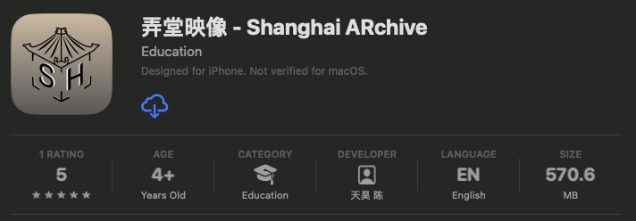
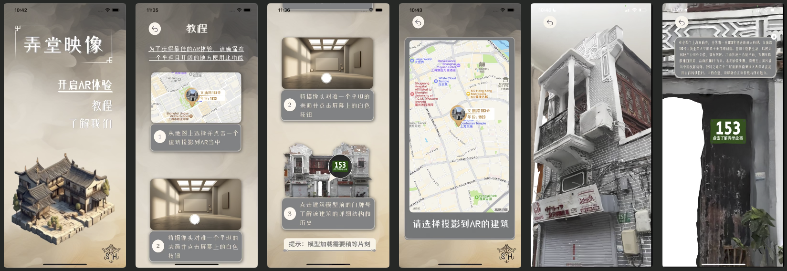

# 弄堂映像 - Shanghai ARchive

[Published on AppStore!](https://apps.apple.com/cn/app/%E5%BC%84%E5%A0%82%E6%98%A0%E5%83%8F-shanghai-archive/id6458735845?l=en-GB)

[News publication!](https://mp.weixin.qq.com/s?__biz=MzI1NzYyMjA3Ng==&mid=2247498863&idx=1&sn=7cc557159aef320690de9539d6ed451f&chksm=ea16153cdd619c2a79d0320e99277d1d7ae35ad7de6c384b809818af27d9afe634a46e38b55e&scene=0&xtrack=1&key=bb7bb5b4dab62052c608ad9512e687273fcfb382b77f5ee2dd46ed2fe95bc4e661531ec3c31fed273b74494b54dbd909bd91891ff9a09ca39ce48770bf1f92f45336594598714e51942b99ada6ae031a57d002245637fc03173505b0de617087df416520923fc694a6308835e49b44fa0435993ca9275f9c5ef18d0365fb4f7c&ascene=1&uin=MTgwOTc1NzY5Nw%3D%3D&devicetype=iMac+MacBookPro18%2C3+OSX+OSX+14.1.1+build(23B81)&version=13080610&nettype=WIFI&lang=en&countrycode=CN&fontScale=100&exportkey=n_ChQIAhIQAchXdxaJoT235mBEC9BJOBKTAgIE97dBBAEAAAAAAGOTLrc7GhoAAAAOpnltbLcz9gKNyK89dVj0lnl7sCdmHcLyvG%2Bzdy0TFUcz5AkAXyALIz56RVwTkH5mztNIpbDTIzV1uRL2b8hSUEJ8CtQCQUnEa%2Fb%2BvD7CbqJjkMEgIev5PyzKIOCT5i%2F20VywxUyRYDGi%2Ba%2Bnn1iUd1qg6uJrU8ZwbjFfcLh4jmHJ5NyWy9g2CtobnkHyr%2FOqHegETayvrByap%2F5QNvgw9Ayd77ee234qRATe4U3xC%2FbjdsNZnezXbhTya1mYFHUO9umXMRhZbcx9znf5GVeyibyARw23v5W1u5GoVD3UAWyMzIwlmZjjqIPGiFzjM134T8v7CVpaURfqfmGP&acctmode=0&pass_ticket=nZ1FA06jduNJr7OIESLVgNyczd3W%2B3PMimLQszqut9bcrqJwUTaGylEhCTZSQCbtcFoUMpomgGToxSQc%2FWeEuw%3D%3D&wx_header=0)

### Team and Responsibilities

Shared responsibilities - gathering footage, contacting historical and government agencies

| Member      | Role                                                      |
| ----------- | --------------------------------------------------------- |
| Aaron Chen  | 3d modeling (lead), UI design                             |
| Eddy Poon   | scanning (lead)                                           |
| Ray Sun     | 3d modeling, UI design, app development                   |
| Emma Teng   | UI design (lead)                                          |
| Tario You   | 3d modeling, UI design, app development (lead)            |
| Steven Zhai | 3d modeling, UI design,                                   |

Special thanks to Clarisse for the historical information, putting us in contact with the government, and publishing stories.

### About Us

We are a team of six high school students from Shanghai American School, united by a shared passion for preserving and illuminating Shanghai’s rich cultural tapestry through innovative technology. With a specific focus on the city’s distinctive alleyway architecture — a historical cornerstone that has punctuated Shanghai’s landscape for generations — we have sought to encapsulate its essence in a way that is not just easily accessible but also excitingly interactive.

Our project pivots on the dual axes of Augmented Reality (AR) and iOS application development, a pioneering marriage of technologies purposed to document the unique architectural style of the alleyways in Shanghai’s historic Huangpu District. In capturing the architectural intricacies with high-definition cameras and drones, we’ve brought to life the age-old charm of Shanghai’s traditional alleyway structures. The data procured was meticulously transformed into realistic 3D models with our proprietary AI model, LUMA. Our iOS application is thus a seamless fusion of these 3D renderings and comprehensive historical narratives, crafting a deeply immersive exploration of Shanghai’s alleyway architecture.

In the face of Shanghai’s relentless modernization, the alleyways — a vivid testament to the city’s evolution — are slowly receding from the public consciousness. Yet, our endeavors ensure these architectural milestones thrive in the digital realm. Through our application, we envision creating a platform for people worldwide who are curious about the regional culture of China to engage in a virtual exploration of Shanghai’s history and its idiosyncratic alleyway culture, unfettered by geographical limitations.

我们是来自上海美国学校的六位高中生，希望通过我们开发的 APP 软件更深入的了解和记录上海独有的弄堂文化。我们坚信，在我们生活已久的城市中历史悠久的弄堂建筑是上海的发展中不可遗忘的一面，值得我们以最尖端的科技进行呈现。

在此次项目中，我们采用了增强现实（AR）和 iOS 应用程序开发在上海黄浦区记录了特色的弄堂建筑。我们将这些科技相结合，从一种前所未有的方式，让用户都能欣赏到上海独一无二的里弄建筑。通过用高清摄像头和无人机精心捕捉这些建筑的影像，我们用 AI 模型 LUMA 将影像数据处理成 3D 模型，并将其搭载到我们自主开发的 iOS 应用程序中。应用中不仅有生动逼真的 3D 模型，还有详尽的历史背景信息，让用户在沉浸式体验中感受到弄堂建筑的非凡魅力。

为了上海更好的长久发展，弄堂逐渐的退出了我们的视野。但是通过我们的努力，这些象征着上海时代变迁的建筑将在数字世界中永恒地存在。我们还希望通过我们的应用让海内外对中国地区性文化感兴趣的人，无论身处何处，都能身临其境的感受并深入探索上海的历史和独特的弄堂文化。

### Collaboration

